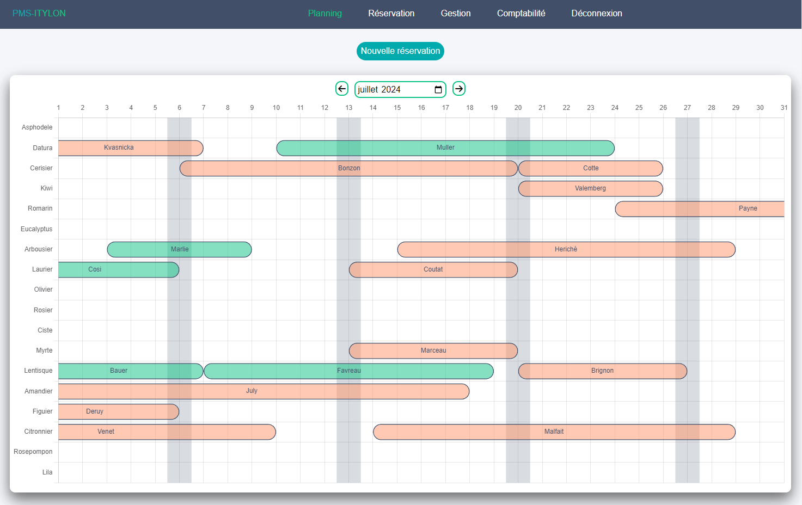
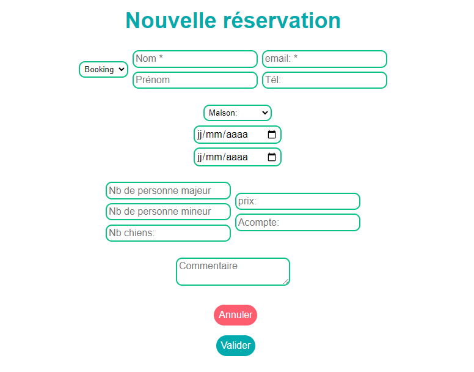
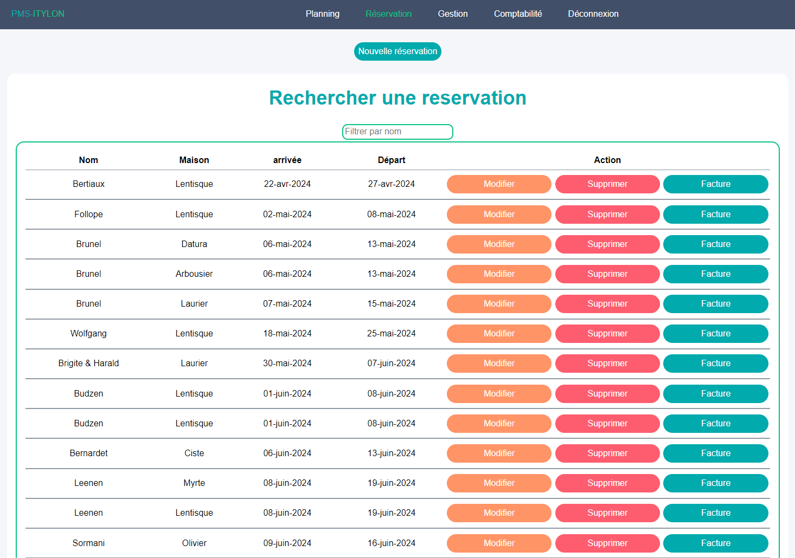
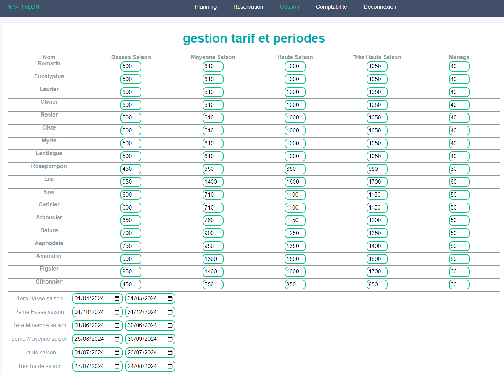
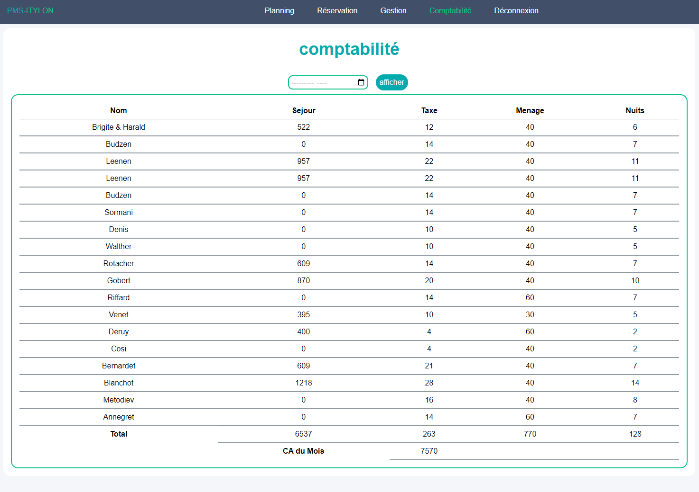

# Mon Application de Gestion de Réservations de Maisons de Vacances

## Description
Ce projet consiste en un outil de gestion des réservations pour une résidence de location de maisons de vacances. 
L'objectif principal de cet outil est de permettre au propriétaire (moi-même, pour l'instant) de gérer efficacement les réservations et la disponibilité des maisons de vacances.

# Technologies Utilisées
- PHP pour la logique backend
- JavaScript pour l'interactivité côté client (utilisation de Chart.js pour le diagramme de Gantt)
- HTML/CSS pour l'interface utilisateur
- MySQL pour la base de données des réservations

## Captures d'écran

# Fonctionnalités Principales

### Authentification des Utilisateurs
- Les utilisateurs doivent se connecter avec un mot de passe valide pour accéder à l'outil.
- Une fois connecté, l'utilisateur reste connecté tant qu'il navigue sur le site, mais doit se reconnecter après une période d'inactivité ou s'il ferme son navigateur.

### Gestion des Réservations
- Les utilisateurs peuvent consulter les réservations existantes ainsi que créer de nouvelles réservations en saisissant les informations nécessaires dans un formulaire.
- Les réservations sont affichées sous forme de diagramme de Gantt, permettant aux utilisateurs de visualiser facilement les périodes de disponibilité et d'occupation des différentes maisons.
- Les administrateurs peuvent supprimer ou mettre à jour les détails des réservations existantes via un formulaire dédié.

### Gestion des Tarifs et Périodes
- Les administrateurs peuvent mettre à jour les prix des différentes maisons ainsi que les dates de début et fin de chaque periodes de la saison estival.
- Les tarifs de chaque maison et les périodes sont affichés dans un tableau récapitulatif dans la section de gestion, facilitant la navigation et la mise à jour des informations.

### Génération de Factures
- La génération de factures est déclenchée manuellement en cliquant sur un bouton "Générer Facture" après avoir ouvert les détails d'une réservation spécifique.
- Une fois le bouton "Générer Facture" cliqué, la facture est automatiquement générée au format Excel, contenant les détails de la réservation ainsi que les montants à payer.
- La facture générée est automatiquement téléchargée sur l'appareil de l'utilisateur dès sa création, offrant ainsi une expérience fluide et efficace.
- De plus, les factures générées sont sauvegardées dans un répertoire d'archives de l'application, permettant un accès facile et une gestion efficace des factures passées.

### Comptabilité
- L'application offre une fonctionnalité de comptabilité permettant de calculer les revenus générés par les réservations sur une période spécifique. Elle affiche également un récapitulatif total des revenus pour le mois sélectionné.
- Les données de comptabilité sont présentées sous forme de tableau avec les détails sur les revenus par client, y compris le montant du séjour, la taxe, le coût du ménage et le nombre de nuits.

## Installation
 a venir....
## Utilisation
a venir....

N'hésitez pas à contribuer au projet en signalant des problèmes ou en proposant des améliorations!

Prochain objectifs:

### Gestion des sessions : 
- Améliorer la gestion des sessions en utilisant des cookies de session plus complexes pour des raisons de sécurité.

### Mise à jour de la méthode d'exécution des requêtes PDO : 
- Mettre à jour la méthode d'exécution des requêtes PDO pour utiliser la méthode la plus récente et améliorer la sécurité.

### Implémentation de la structure MVC : 
- Considérer l'apprentissage et l'implémentation de la structure MVC pour une meilleure organisation du code PHP.
